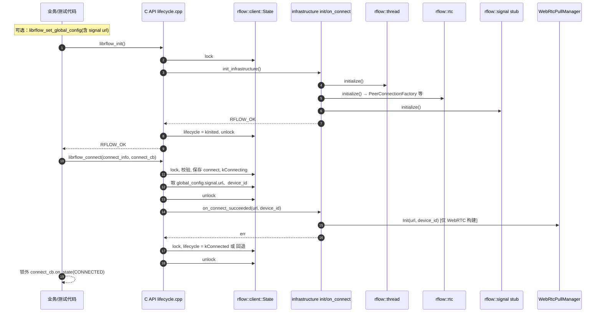
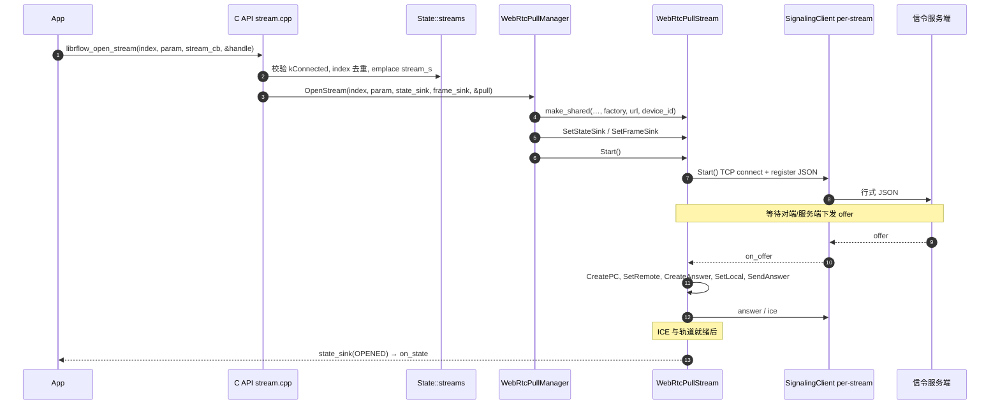
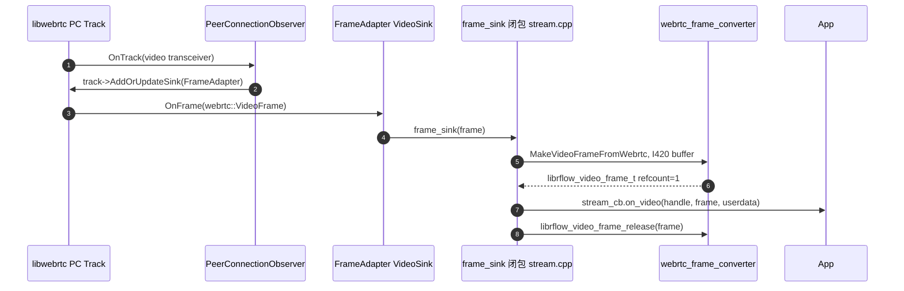

# 时序图：建连、开流、收帧

说明：虚线部分表示「异步/在其它线程上」的示意；实际回调线程以当前实现与后续「统一回调线程池」演进而定。

---

## 1. 建连（`librflow_init` → `librflow_connect`）

> `librflow_connect` 当前语义：**不经过独立设备鉴权长连**，主要是拉起基础设施与 `WebRtcPullManager` 配置；真实设备/会话信令在「未来 core/signal」中扩展。

---

## 2. 开流（`librflow_open_stream` → 信令 + 建 PC）

> `open_stream` 失败路径：`Manager::OpenStream` 失败会从 `State.streams` 移除该次登记并返回错误码，不会泄漏 handle。

---

## 3. 收帧（`OnTrack` → `on_video`）

> 若需跨栈持有帧，应使用 `librflow_video_frame_retain`，用完 `release`（与 `librflow_common.h` 说明一致）。
