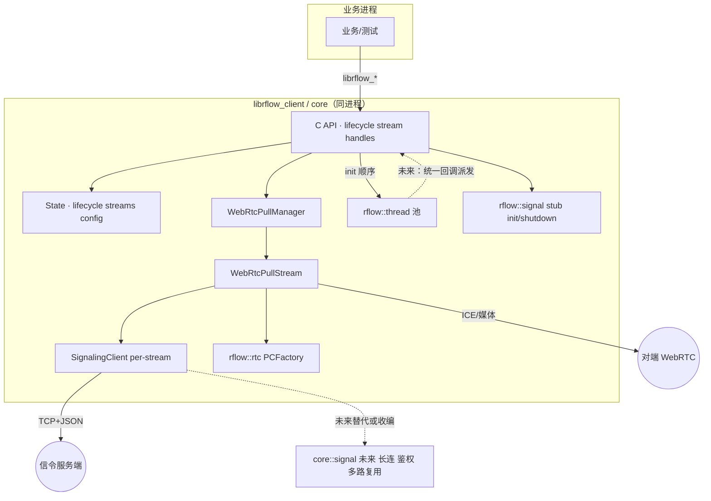
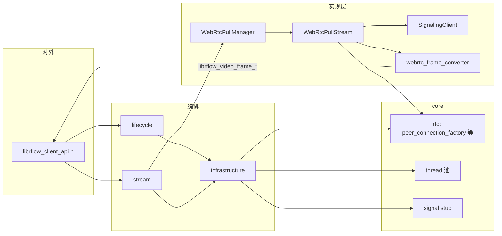

# C4：Client 拉流（容器/组件 + 未来态）

阅读约定：**实线**＝当前依赖/调用方向；**虚线**＝计划中的抽象或替代关系。

> 用 flowchart 表达 C4「容器/上下文」；若你本地有 [Mermaid C4 扩展](https://mermaid.js.org/syntax/c4.html)，可自行迁移为 `C4Context` / `C4Container` 图。

---

## 容器级（C4 语境：同进程 + 外部系统）

---

## 组件级（C4 Component，Client 子域）

### 虚线：后续扩展落点

| 方向 | 说明 |
|------|------|
| `core::signal` 实装 | 设备级/会话级信令长连；`send_notice` / `service_req` 走统一通道；可与「单连接多路 index」结合，减少 per-stream `SignalingClient`。 |
| `rflow::thread` | 所有 `on_*` 经固定工作线程/池派发，满足 `librflow_common` 中线程模型承诺。 |
| 配置全量下推 | `signal_config` 的 url / 超时 / 重连 / ICE(STUN/TURN) 自 global_config 注入，替代管理类内硬编码默认项。 |
