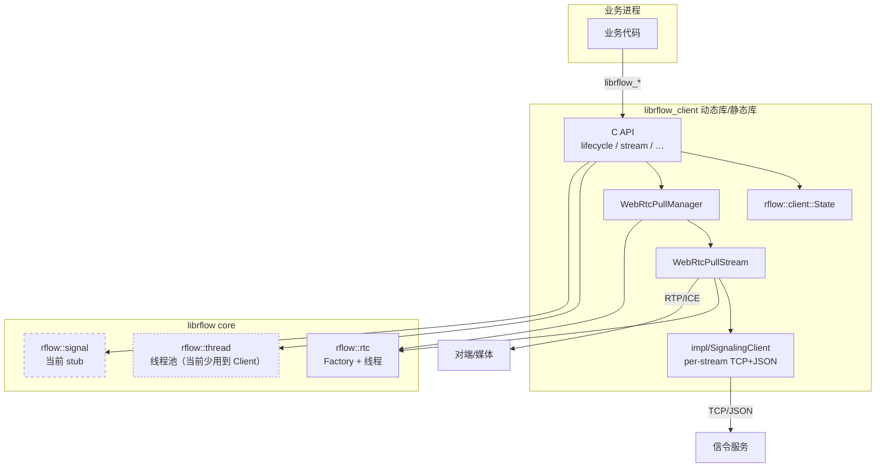
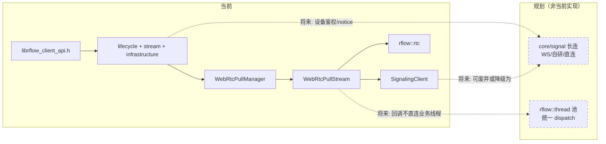

# 容器/组件级视图与「未来态」

采用 Mermaid 表达 **C4 风格** 的容器与组件：实线=当前主路径，虚线=规划中的扩展。非严格 C4-PlantUML 语法，但便于在 Markdown 中维护。

---

## 1. 容器图（C4-Container 风格）

说明：

- **当前**：开流、SDP/ICE 由 `WebRtcPullStream` + 每路 `SignalingClient` 完成；`rflow::rtc` 为硬依赖；`rflow::thread` / `rflow::signal` 在 `init` 中拉起，Client 主路径几乎未用。
- **虚线意涵**：`thread` 用于将来统一回调派发；`signal` 为将来设备级长连信令抽象位。

---

## 2. 组件图 + 未来态（虚线）

**评审时可口述**：`connect` 若接入真实设备握手，可落在 `B` 与 `G` 之间；每流 TCP 可收敛为**单连接多路**或**共享 G 的会话**（需协议升级）。

---

## 3. 与公共头文件的关系

| 头文件 / 配置 | 作用 |
|---------------|------|
| `librflow_client_api.h` | 对外 C ABI；业务只依赖于此 |
| `librflow_common.h` | 日志、global_config、video_frame 等 |
| `librflow_global_config` 中 `signal` | 当前用于 **URL 等** 注入；与 `rflow::signal` 实现层尚未合一 |
