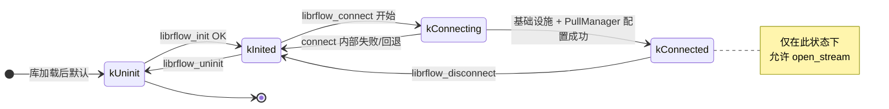
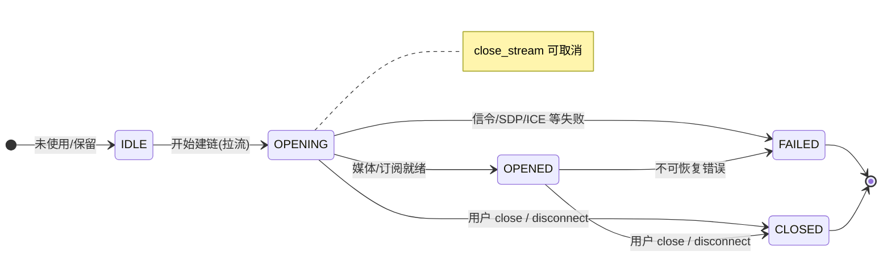

# 状态图：Client 生命周期与流 + 与幂等 API 的关系

头文件约定了调用顺序与幂等行为；下图为实现侧应对齐的**状态**（见 `librflow_common.h` 线程/生命周期章、`librflow_client_api.h` 注释）。

---

## 1. 进程/连接生命周期 `LifecycleState`（实现侧）

> 与对外枚举 `rflow_connect_state_t` 相关但不逐字一一对应；`connect` 成功后才允许 `open_stream`。

**与 API 的约束**

| API | 要求 |
|-----|------|
| `librflow_set_global_config` | 仅在 `kUninit` 时允许（在 init 前）。 |
| `librflow_init` | 从 `kUninit` 进入 `kInited`；已 init 则幂等成功。 |
| `librflow_connect` | 需 `kInited`；若已在 Connecting/Connected 则 `RFLOW_ERR_STATE`。 |
| `librflow_open_stream` | 需 `kConnected`；否则 `RFLOW_ERR_STATE`。 |
| `librflow_disconnect` | 在 `kConnecting` 或 `kConnected` 时清理；否则幂等 `RFLOW_OK`；**内部关闭所有未关的 stream**（与头文件「强清理」一致）。 |
| `librflow_uninit` | 内部会先 `disconnect`，再关基础设施；`kUninit` 上再调幂等。 |

---

## 2. 单路流 `rflow_stream_state_t`（对业务可见的语义子集）

**终态**：`FAILED` 与 `CLOSED` 均为终态；头文件约定**不会**从 `FAILED` 再接到 `CLOSED` 的「二次终态」通知。

---

## 3. 幂等一览（与状态配合）

| API | 幂等行为（摘要） |
|-----|------------------|
| `librflow_disconnect` | 非连接状态直接成功；不重复派发「已断」副作用（以当前实现为准，业务勿依赖未定义次数的重复回调）。 |
| `librflow_close_stream` | `NULL` 或已关闭：成功。 |
| `librflow_uninit` | 可多次；最后一次保证子系统与线程清理顺序。 |
| 同一 `index` 再次 `open_stream` | 应返回 `RFLOW_ERR_STREAM_ALREADY_OPEN`（实现侧去重）。 |

---

## 4. 回调与锁（评审常见坑）

- 头文件要求：**不要**在回调里再调 `init` / `uninit` / `connect` / `disconnect`；`close_stream` 在允许白名单内但需注意死锁（若 SDK 在持 `State` 锁时直接进回调，会重入同锁）。
- 实现演进目标：`disconnect` / `close` 返回前与回调线程的 `happens-before` 关系以 `librflow_common` 的「uninit 前回调 drain」为准，当前若未完全达到，属已知技术债，应在 `doc` 或 ADR 中跟踪。
