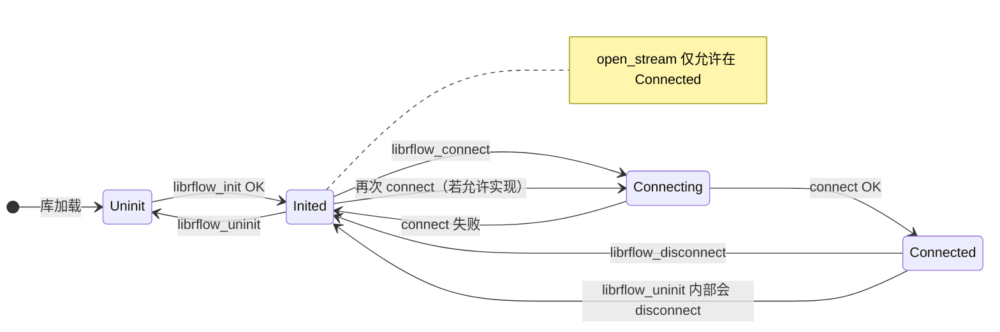
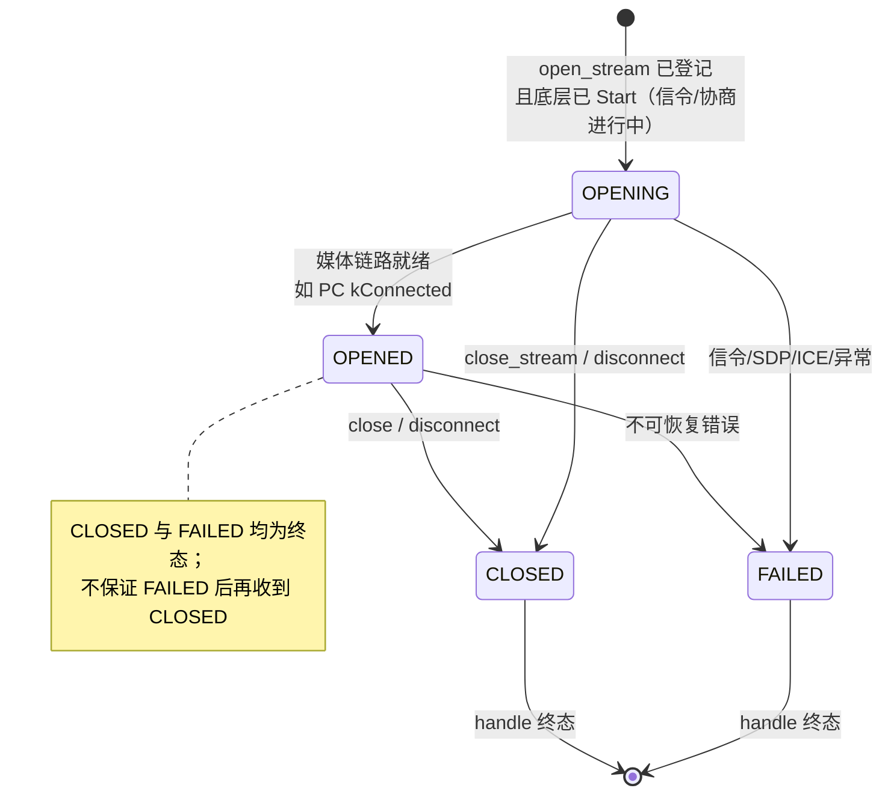

# 状态与幂等

连接维与流维分开；**终态**后不再为同一 handle 派发流回调（见头文件 `librflow_common.h` 中约定）。

---

## 1. 连接生命周期（`LifecycleState` / C API 对应）

**与公开枚举对应**：`RFLOW_CONN_*` 在回调里体现；内部 `kConnecting` 等为实现细分。

---

## 2. 流状态（单路 `librflow_stream_handle_t`）

**实现注**：`IDLE` 等枚举在头文件中有更泛化语义；公开拉流句柄从 `OPENING` 进入主路径更常见。

---

## 3. 幂等与「允许再调」速查

| API | 幂等行为（意图） | 注意 |
|-----|------------------|------|
| `librflow_init` | 多次调用：已 Inited 则直接 OK | |
| `librflow_uninit` | 强清理：内部 disconnect、关流、join 工作线程 | 头文件承诺返回前回调 drain 完毕（目标语义） |
| `librflow_connect` | 仅当非 Connected/Connecting 时允许 | 单设备连接 |
| `librflow_disconnect` | 重复调用：无连接时 OK | 会关所有流 |
| `librflow_open_stream` | 同 index 已存在 → `ERR_STREAM_ALREADY_OPEN` | 须已 Connected |
| `librflow_close_stream` | 同一 handle 重复关 → OK | 终态后 handle 勿再使用 |
| `close_stream` 回调内 | 允许（白名单见 common 头） | 禁止在回调里 connect/disconnect/uninit 等长阻塞或再入 |

---

*若实现与上表有偏差，以代码为准，并应同步修正本文档。*
