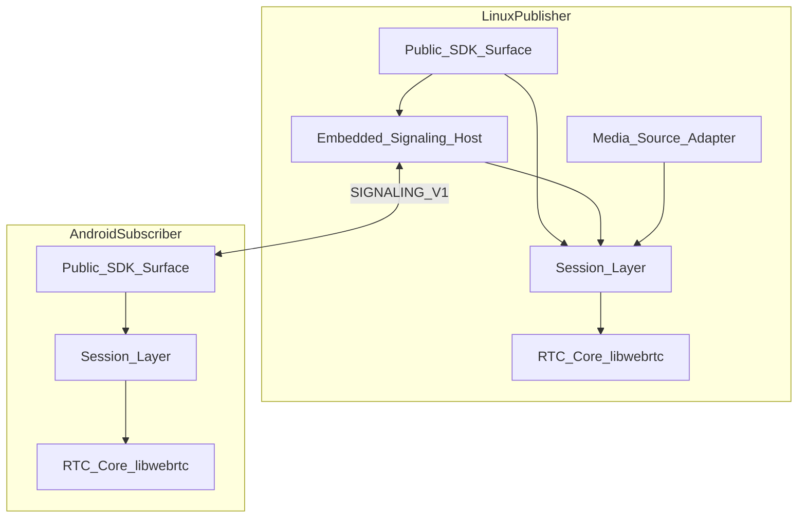

# 总体架构（v1）

## 1. 文档定位与假设

本系列文档只定义 **产品边界、模块划分、接口方向、协议与状态机**，不涉及具体实现代码。

**假设（v1 固定）**

- 当前阶段可仅产出或迭代文档；实现与 API 细节以后续头文件与实现为准。  
- **平台矩阵**：发布端 **Linux aarch64**；客户端 **Android arm64-v8a**。  
- **信令**：发布进程 **内嵌** WebSocket 信令服务器，v1 **不**单独交付外置信令服务产品。  
- **公开接入面**：以 **Native（C ABI + 可选 C++ 封装）** 为主；不把 Java/Kotlin 纳入 SDK 公共 API。  
- **鉴权**：业务侧已有具体校验实现；文档仅保留 **协议字段（如 `token`）** 与 **发布进程内认证回调接口** 的架构边界，不展开 token 结构与算法。  

## 2. 与历史 scope / 信令文档的关系

仓库中 [SCOPE.md](SCOPE.md) 曾描述「Linux 以接收为主、Phase 2 发送」以及「SDK 不负责信令网络传输」等假设；[SIGNALING.md](SIGNALING.md) 侧重 **宿主转发 SDP/ICE** 的通用边界。

**v1 以本文档及同系列架构文档为准**：首版产品形态为 **Linux 发布进程（采集 + 推流 + 内嵌信令）** 与 **Android 仅订阅客户端**。若其他文档出现与本文冲突的表述，以实现本拓扑与 [SIGNALING_V1.md](SIGNALING_V1.md) 的版本为优先；历史段落可视为「非内嵌信令」集成形态的补充说明。

## 3. 产品定位与角色

- **单一产品**：**CommonVideoSDK**（仓库目录名可为 ComVideoSDK）。**发布进程与 Android 客户端均为同一套 SDK 的使用者**。  
- **发布进程不是**独立的「服务端 SDK 产品线」：它使用本产品中的 **发布能力**（runtime、`publish_session`、内嵌信令、`media_source`）。  
- **v1 只支持两类角色**：  
  - **Linux aarch64 发布进程**：初始化 SDK、摄像头/麦克风采集、编码推流，进程内嵌 **WebSocket + JSON** 信令服务。  
  - **Android arm64-v8a 订阅客户端**：使用本产品中的 **订阅能力** 接入信令、完成 WebRTC 建连、接收解码后的音视频帧。  
- **v1 不支持 Linux 客户端**（Linux 仅作为发布端运行环境）。  

## 4. 运行拓扑

- 信令链路：**Android 订阅端** 作为 WebSocket 客户端连接 **发布进程内** 的信令主机。  
- 媒体链路：WebRTC（由 **libwebrtc** 提供），细节见 [WEBRTC_BASE.md](WEBRTC_BASE.md)。  

## 5. 公开概念面（相对 PeerConnection 的角色化模型）

对外文档与 API 语义从底层 `PeerConnection` 操作，收敛为以下概念（名称用于架构描述，具体 C 符号以实现为准）：

| 概念 | 说明 |
|------|------|
| `runtime` | 进程级初始化与全局资源生命周期 |
| `publish_session` | Linux 侧一对一发布会话（采集 → RTC 发送） |
| `subscribe_session` | Android 侧一对一订阅会话（RTC 接收 → 解码输出） |
| `media_source` | 发布侧媒体输入抽象；v1 默认设备采集 |
| `callbacks` | 状态、错误、帧、统计等异步通知 |

## 6. 内部五层结构

依赖方向自上而下调用底层；**Embedded Signaling Host** 仅存在于 **发布进程**。

| 层 | 职责 |
|----|------|
| **Public SDK Surface** | 对外 C ABI（及可选 C++ wrapper）；发布与订阅两套入口共用 RTC 与类型约定 |
| **Embedded Signaling Host** | 发布进程内 WebSocket 服务；解析/生成 v1 JSON 消息，与会话层交互 |
| **Session Layer** | `publish_session` / `subscribe_session` 状态机；驱动 offer/answer/ICE 与生命周期 |
| **Media Source Adapter** | 发布侧输入抽象；v1 默认 **V4L2 + ALSA** |
| **RTC Core** | libwebrtc 封装；线程、统计、错误上报、编解码与传输会话 |

## 7. RTC 基座

- **唯一 RTC 基座**：**libwebrtc**（与 [WEBRTC_BASE.md](WEBRTC_BASE.md) 一致）。  

## 8. 公开类型索引（文档级「单一真源」）

架构文档中固定下列 **概念类型**（字段级定义以实现/头文件为准，此处仅列职责）：

| 类型 | 职责摘要 |
|------|----------|
| `GlobalConfig` | 日志、线程、全局 RTC 参数等运行时级配置 |
| `PublishConfig` | 发布会话：码率、分辨率、设备选择、内嵌信令监听地址等 |
| `SubscribeConfig` | 订阅会话：信令 URL、ICE 服务器、会话标识等 |
| `VideoFrame` | 解码后视频帧缓冲区描述（时间戳、格式、生命周期约定在实现中定义） |
| `AudioFrame` | 解码后音频帧缓冲区描述 |
| `StatsSnapshot` | 码率、丢包、RTT 等统计快照 |
| `ErrorInfo` | 错误码、消息、可恢复性等 |
| `ConnectionState` | 信令与/或 PeerConnection 聚合连接状态（以实现映射为准） |

**能力归属矩阵**

| 能力 | 发布端（Linux） | Android 订阅 |
|------|-----------------|--------------|
| 初始化 / 销毁 runtime | 是 | 是 |
| 启动 / 停止内嵌信令 | 是 | 否 |
| 创建设备采集源（`media_source`） | 是 | 否 |
| 创建 / 关闭 `publish_session` | 是 | 否 |
| 注入鉴权验证回调 | 是 | 否 |
| 创建 / 关闭 `subscribe_session` | 否 | 是 |
| 连接发布端信令地址 | 否 | 是 |
| 完成 auth、join、offer/answer、ice（协议级） | 主机侧（内嵌信令 + Session） | 是（客户端） |
| 输出解码后音视频帧、状态、统计 | 否（v1 发布端不以文档形式承诺接收帧输出） | 是 |

## 9. v1 非目标（固定）

| 非目标 | 说明 |
|--------|------|
| Linux 客户端 | Linux 仅发布端 |
| 多人 / 房间 | 仅 **1 对 1** 会话 |
| 1 对多 | 同上 |
| 录制 / 转码 | 不在 v1 架构范围 |
| RTSP / 文件作为 v1 输入 | 仅媒体源扩展点预留，见 [MEDIA_SOURCE_ABSTRACTION.md](MEDIA_SOURCE_ABSTRACTION.md) |
| Java/Kotlin 公共 API | 仅宿主私有 JNI |
| 外置信令服务（v1 产品形态） | 信令内嵌于发布进程；不单独拆信令服务产品 |
| 具体鉴权实现细节 | 仅 token 字段与回调边界 |

## 10. 相关文档

- [ARCHITECTURE_PUBLISHER.md](ARCHITECTURE_PUBLISHER.md)  
- [ARCHITECTURE_ANDROID_SUBSCRIBER.md](ARCHITECTURE_ANDROID_SUBSCRIBER.md)  
- [SIGNALING_V1.md](SIGNALING_V1.md)  
- [STATE_MACHINE_AND_ERRORS.md](STATE_MACHINE_AND_ERRORS.md)  
- [MEDIA_SOURCE_ABSTRACTION.md](MEDIA_SOURCE_ABSTRACTION.md)  
- [ARCHITECTURE_VERIFICATION.md](ARCHITECTURE_VERIFICATION.md)  
