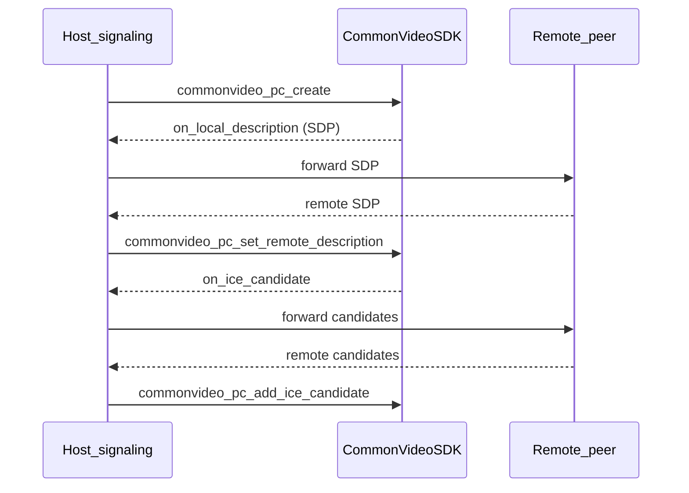

# 信令边界

## 1. 原则

- **SDK 不负责** 信令消息的 **网络传输**（WebSocket、gRPC、自定义 TCP 等均由宿主实现）。
- **SDK 负责** WebRTC 状态机相关数据：
  - 本地 **SDP**（offer/answer）生成与设置远端 SDP。
  - **ICE candidate** 的生成、添加与移除（含 `end-of-candidates` 语义，随 API 使用方式约定）。

## 2. 典型数据流

## 3. 宿主职责清单

- 将 `on_local_description` / `on_ice_candidate` 序列化并通过信令通道发送。
- 接收对端 SDP 后调用 `commonvideo_pc_set_remote_description`（注意 offer/answer 顺序与状态）。
- 接收对端 candidate 后调用 `commonvideo_pc_add_ice_candidate`；若对端发送 null candidate 表示结束，按 W3C 惯例处理（具体映射见头文件注释与实现）。
- **STUN/TURN** 服务器列表在创建 PeerConnection 前通过配置传入 SDK（不在信令协议内强制格式）。

## 4. 隐私与安全

- SDP 与 candidate 可能包含 **内网 IP**；日志默认应 **脱敏** 或由宿主控制日志级别。
- 信令通道 **TLS** 由宿主保证；SDK 不替代 TLS。
