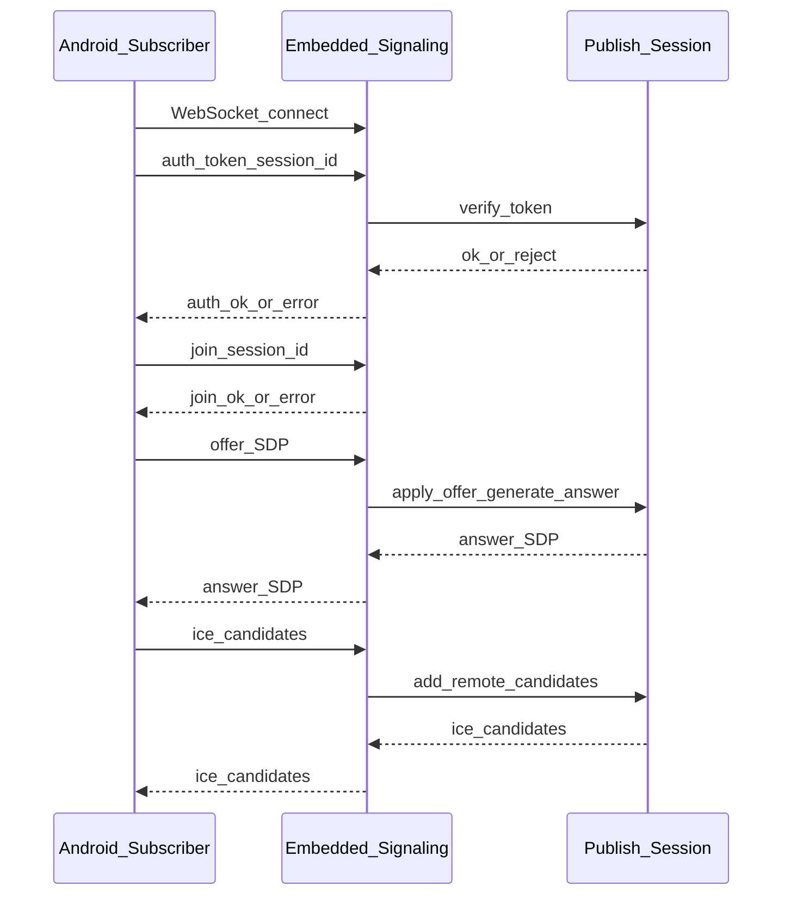

# 信令协议 v1（WebSocket + JSON）

## 1. 范围与约束

- **传输**：**WebSocket**；**载荷**：**JSON** 文本帧（单条消息一个 JSON 对象，具体分帧策略以实现为准）。  
- **拓扑**：固定 **1 对 1** 会话；**无**房间、**无**多人。  
- **服务端**：运行在 **Linux 发布进程** 内的 **Embedded Signaling Host**；**客户端** 为 **Android 订阅端**。  
- **鉴权**：消息中保留 **`token`**；校验逻辑见 [ARCHITECTURE_PUBLISHER.md](ARCHITECTURE_PUBLISHER.md) 与宿主回调；**本文不定义** token 内容与算法。  

## 2. 消息集（固定）

| 类型 | 用途 |
|------|------|
| `auth` | 客户端发起鉴权 |
| `join` | 客户端请求加入已存在的发布会话 |
| `offer` | SDP offer（通常由订阅端生成并发往发布端，或按实现约定方向，见 §4） |
| `answer` | SDP answer |
| `ice` | ICE candidate 交换 |
| `close` | 正常关闭 |
| `error` | 错误通知（可由任一侧发送，语义见 §6） |
| `stats` | 可选统计上报（内容以实现为准） |

每条消息应包含 **`type`** 字段，取值为上表小写字符串（或文档与实现约定的统一枚举）。

## 3. 通用字段约定

下列字段为 **架构级建议**；实现可增减，但须在实现文档中固定，避免与 Android/Linux 两端解析不一致。

| 字段 | 说明 |
|------|------|
| `type` | 消息类型 |
| `version` | 协议版本，建议固定 `1` |
| `session_id` | 一对一会话标识（由发布端创建会话时生成或由配置指定，需在 `join` 中一致） |
| `token` | `auth` 中携带的凭证字符串 |
| `sdp` | SDP 文本 |
| `sdp_type` | `offer` 或 `answer`（与 WebRTC 约定一致） |
| `candidate` | ICE candidate 字符串，结束可用 null 或约定字段表示 end-of-candidates |
| `sdp_mid` / `sdp_mline_index` | 与 candidate 关联的标准字段 |
| `code` | `error` 中的机器可读错误码 |
| `message` | `error` 中的人类可读说明 |

## 4. 时序（正常建连）

**约定（v1 架构默认）**：订阅端为 **WebRTC offer 发起方** 时，信令中 **`offer` 由 Android 发往发布端**，**`answer` 由发布端返回**。若实现选择与下述不同，须在实现文档中显式说明并两端对齐。

**说明**

- `auth` 失败：发布端通过 **`error`** 或关闭连接；状态机见 [STATE_MACHINE_AND_ERRORS.md](STATE_MACHINE_AND_ERRORS.md)。  
- `join` 在 **未知 session_id** 或发布会话未就绪时失败：返回 **`error`** 并落错误码。  
- **`close`**：任一侧可发起；对侧进入关闭流程并释放 RTC 资源。  

## 5. 消息方向摘要

| type | 主要发起方 | 主要接收方 |
|------|------------|------------|
| `auth` | Android | 发布端（信令主机） |
| `join` | Android | 发布端 |
| `offer` | Android（默认） | 发布端 |
| `answer` | 发布端 | Android |
| `ice` | 双向 | 双向 |
| `close` | 双向 | 双向 |
| `error` | 双向 | 双向 |
| `stats` | 双向（可选） | 对端 |

## 6. 错误语义（`error`）

- **`code`**：架构层保留 **枚举空间**（实现需定义表），示例类别：鉴权失败、会话不存在、信令状态非法、ICE/SDP 失败、内部错误。  
- **`message`**：便于日志与调试；**不得**依赖其稳定性做程序分支。  
- 收到 `error` 后，会话应迁移至 **失败或已关闭** 状态；是否自动断开 WebSocket 以实现为准，但须在 [STATE_MACHINE_AND_ERRORS.md](STATE_MACHINE_AND_ERRORS.md) 中一致描述。  

## 7. `stats`（可选）

- 用于周期性或非周期性统计交换（如码率、丢包）；**非 v1 必选**。若启用，字段集在实现文档中定义。  

## 8. 隐私与安全

- SDP 与 ICE 可能含内网 IP；日志需脱敏或由宿主控制级别（与 [SIGNALING.md](SIGNALING.md) 原则一致）。  
- **WSS/TLS**：由部署与宿主配置保证；协议层不替代 TLS。  

## 9. 相关文档

- [ARCHITECTURE.md](ARCHITECTURE.md)  
- [STATE_MACHINE_AND_ERRORS.md](STATE_MACHINE_AND_ERRORS.md)  
- [ARCHITECTURE_PUBLISHER.md](ARCHITECTURE_PUBLISHER.md)  
- [ARCHITECTURE_ANDROID_SUBSCRIBER.md](ARCHITECTURE_ANDROID_SUBSCRIBER.md)  
