# Client SDK 对外接口设计文档

> 对应头文件：`include/robrt/Client/librobrt_client_api.h`  
> 目标平台：Android arm64（native C++，不经 JVM / Context），Linux arm64 次级  
> 内部实现：封装 WebRTC。Client 端仅负责**订阅拉流 + 解码前/后帧回调**，**不做编码**（编码在 Service 端）  
> ABI 策略：纯 C 导出 + Opaque Handle + Getter / Setter → 结构体布局永不暴露，字段随便加

---

## 1. 设计总则

| 原则 | 说明 |
|---|---|
| 不暴露结构体 | 所有对外类型一律 `typedef struct xxx_s* xxx_t;`，调用方既无法 `sizeof` 也无法访问字段 |
| create / destroy | 配置对象由 SDK 分配，显式 `create` / `destroy` 成对调用 |
| set / get | 字段读写经 accessor 完成；未来增字段只加函数，不破 ABI |
| 回调对象也 opaque | `video_frame` / `stream_stats` 只读 opaque 句柄，靠 getter 取值（音频暂不支持） |
| 幂等强清理 | `uninit` / `disconnect` / `close_stream` 必须幂等；上层无需保证关闭顺序 |
| 回调线程独立 | 所有回调在 SDK 内部工作线程触发；回调内**禁止阻塞**、**禁止调用 SDK 同步 API**（仅 `close_stream` / `retain` / `release` / `librobrt_reply_to_service_req` 等白名单函数安全） |
| 内存所有权明确 | 入参 SDK 只读；出参字符串/buffer 由 SDK 分配，配套 `_free` |
| 错误码分段 | 通用 `0x0xxx` / 连接 `0x1xxx` / 流 `0x2xxx`；错误文本走 thread-local 的 `get_last_error` |

---

## 2. 模块结构

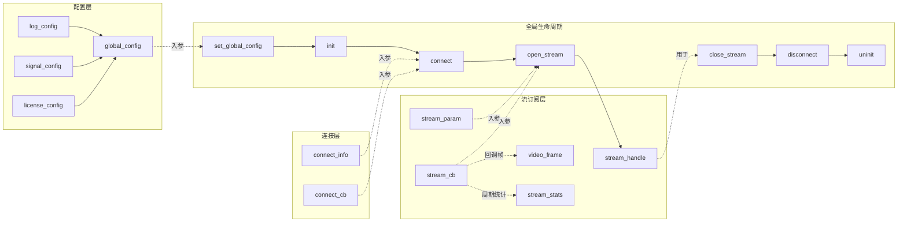

---

## 3. 对象生命周期（状态机）

### 3.1 SDK 全局状态

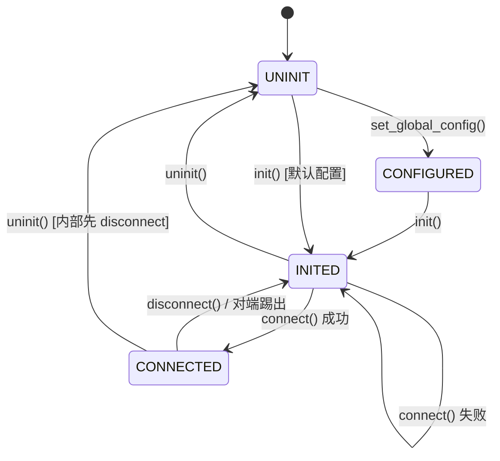

### 3.2 连接状态（robrt_connect_state_t）

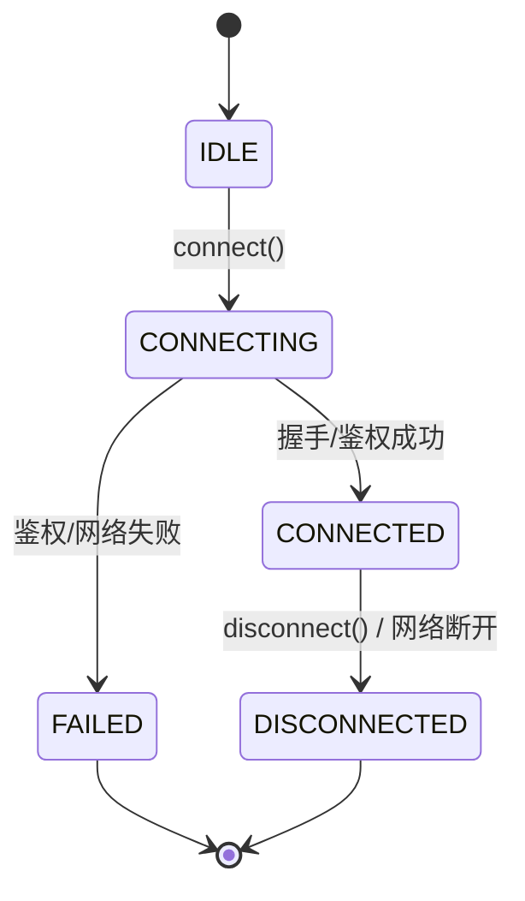

### 3.3 流状态（robrt_stream_state_t）

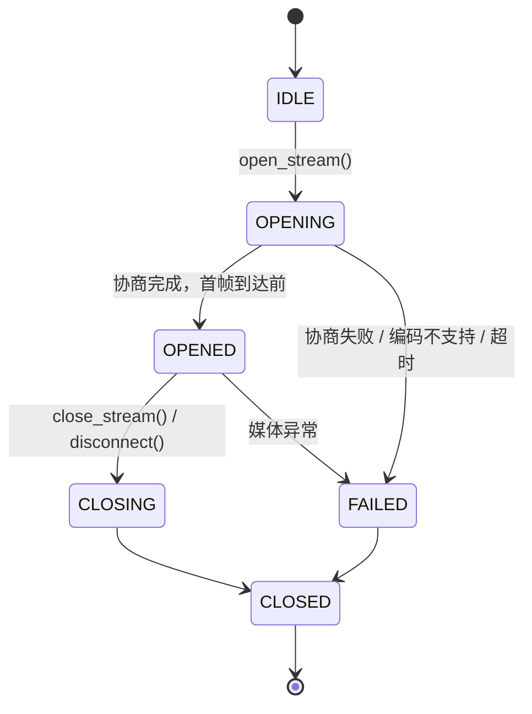

---

## 4. 标准调用时序

### 4.1 完整流程（启动 → 订阅 → 退出）

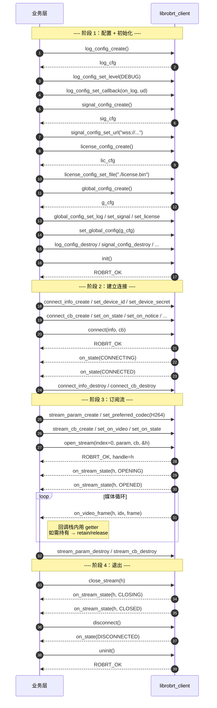

### 4.2 异常场景：上层只调 uninit（幂等强清理）

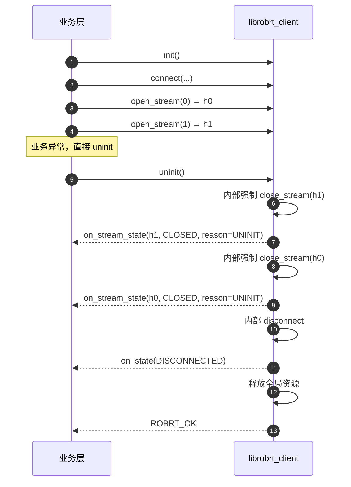

### 4.3 服务端下发请求消息（on_service_req 异步回包）

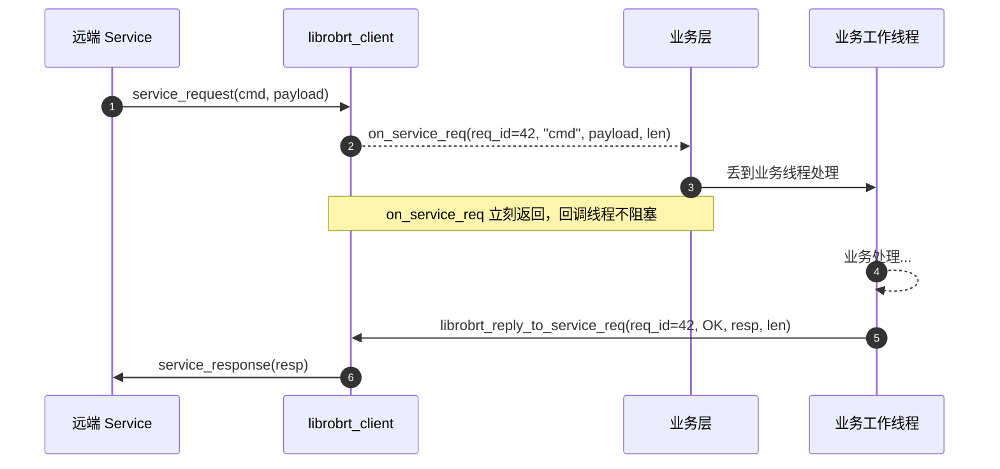

### 4.4 异常场景：连接过程中断网

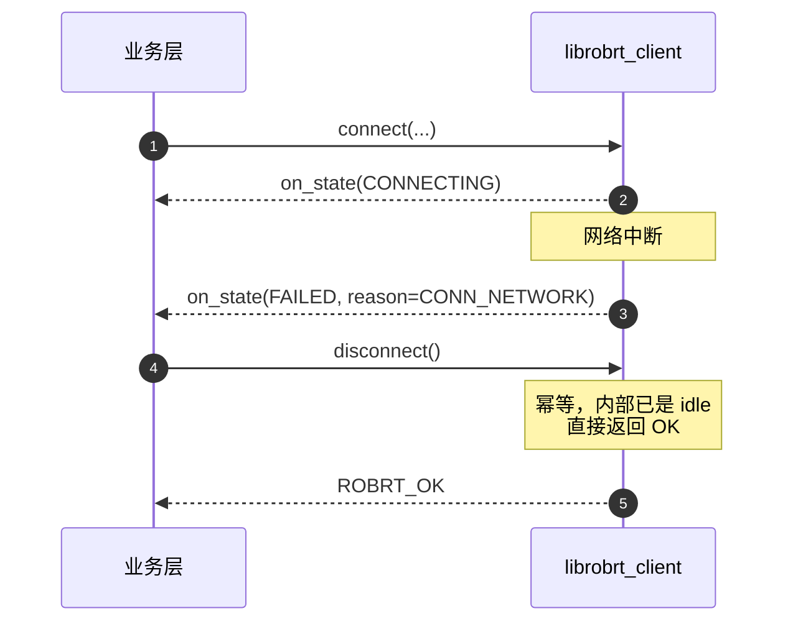

### 4.5 视频帧跨线程持有（零拷贝）

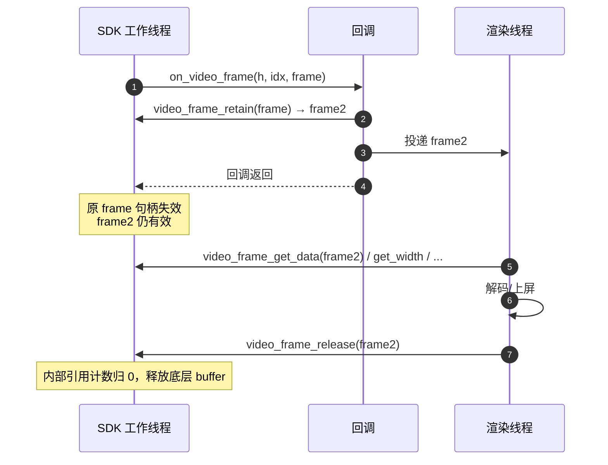

---

## 5. 线程与并发模型

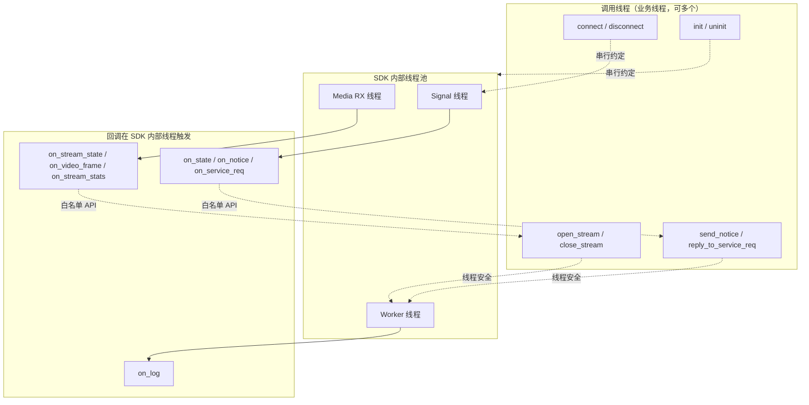

### 5.1 约束

| 类别 | 约束 |
|---|---|
| 全局 API | `set_global_config` / `init` / `uninit` / `connect` / `disconnect` **必须同一线程串行** |
| 流 API | `open_stream` / `close_stream` / `get_stats` 线程安全，可并发 |
| 信令 API | `send_notice` / `librobrt_reply_to_service_req` 线程安全，可并发 |
| 回调内 | **禁止**阻塞；**禁止**回调 init/connect 等同步状态变更 API；**允许**：`close_stream`、`retain`/`release`、`librobrt_reply_to_service_req`、所有 getter |

---

## 6. 内存所有权矩阵

| 对象 | 分配方 | 释放方 | 生命周期 |
|---|---|---|---|
| `xxx_config_t` / `connect_info_t` / `connect_cb_t` / `stream_param_t` / `stream_cb_t` | SDK `create` | 调用方 `destroy` | `set_*` / `connect` / `open_stream` 返回后即可 destroy（SDK 已 copy） |
| `open_stream` 的 `param` 参数 | — | — | 可为 NULL；等价于 `stream_param_create()` 后未改任何 setter 的默认 hint，**次版本内**默认集合稳定，字段见 `librobrt_client_api.h` |
| `stream_handle_t` | SDK (`open_stream` 出参) | SDK (`close_stream` / `disconnect` / `uninit`) | 调用方收到 `CLOSED` 后不得再使用 |
| `video_frame_t` | SDK（回调入参） | SDK（回调返回时） | 仅回调栈内；`retain` 后转为调用方管理，必须 `release` |
| `stream_stats_t` | SDK（回调 / pull 出参） | SDK | 默认仅当前回调栈 / API 返回前有效；`retain` 后转为调用方管理，必须 `release` |
| 入参 `const char*` / 指针 | 调用方 | 调用方 | SDK 内部 copy；API 返回后即可释放 |
| SDK 返回的 `char*` / `void*` | SDK | 调用方 `librobrt_string_free` / `librobrt_buffer_free` | 按函数文档 |

---

## 7. 错误处理

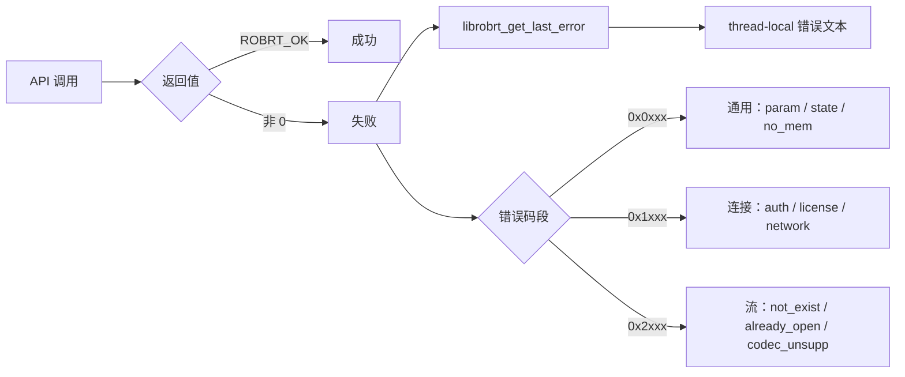

约定：
- 错误码只增不改；删除/复用错误码视为破坏 ABI
- 回调统一返回 `void`；业务反馈走专用 API（如 `librobrt_reply_to_service_req`）

---

## 8. ABI 兼容性保证

| 演进需求 | 允许做法 |
|---|---|
| 给 `log_config` 加新字段 | 加 `librobrt_log_config_set_xxx / get_xxx` 函数，旧 API 不动 |
| 给 `video_frame` 加新字段 | 加 `librobrt_video_frame_get_xxx` 函数 |
| 新增订阅模式 | 加 `librobrt_open_stream_v2(...)`（带新参数），旧 `open_stream` 保持行为 |
| 新增回调事件 | 会话级加 `librobrt_connect_cb_set_on_xxx`；流级加 `librobrt_stream_cb_set_on_xxx`；未注册时不触发 |
| 新增错误码 | 在段内追加，老调用方收到未知码时应归类为通用 `FAIL` |
| 新增枚举值 | 追加末尾，`_UNKNOWN=0` 保持；调用方必须容忍未知值 |

**红线（永远不能做）**：
- 修改已发布函数签名 / 返回类型
- 修改已发布枚举值的数值
- 删除已发布函数 / 枚举值 / 错误码
- 暴露任何结构体的实际布局

---

## 9. 快速上手示例（C）

```c
#include "robrt/Client/librobrt_client_api.h"
#include <stdio.h>

static void on_log(robrt_log_level_t lv, const char *msg, void *ud) {
    fprintf(stderr, "[%d] %s\n", lv, msg);
}

static void on_conn_state(robrt_connect_state_t s, robrt_err_t r, void *ud) {
    printf("conn state=%d reason=%d\n", s, r);
}

static void on_video(librobrt_stream_handle_t h,
                     librobrt_video_frame_t f, void *ud) {
    uint32_t w  = librobrt_video_frame_get_width(f);
    uint32_t sz = librobrt_video_frame_get_data_size(f);
    const uint8_t *p = librobrt_video_frame_get_data(f);
    (void)w; (void)sz; (void)p;
}

int main(void) {
    librobrt_log_config_t    log = librobrt_log_config_create();
    librobrt_log_config_set_level(log, ROBRT_LOG_INFO);
    librobrt_log_config_set_callback(log, on_log, NULL);

    librobrt_global_config_t g = librobrt_global_config_create();
    librobrt_global_config_set_log(g, log);

    librobrt_set_global_config(g);
    librobrt_log_config_destroy(log);
    librobrt_global_config_destroy(g);

    librobrt_init();

    librobrt_connect_info_t info = librobrt_connect_info_create();
    librobrt_connect_info_set_device_id(info, "device-001");
    librobrt_connect_info_set_device_secret(info, "secret-xxx");

    librobrt_connect_cb_t cb = librobrt_connect_cb_create();
    librobrt_connect_cb_set_on_state(cb, on_conn_state);

    librobrt_connect(info, cb);
    librobrt_connect_info_destroy(info);
    librobrt_connect_cb_destroy(cb);

    librobrt_stream_param_t sp = librobrt_stream_param_create();
    librobrt_stream_param_set_preferred_codec(sp, ROBRT_CODEC_H264);

    librobrt_stream_cb_t scb = librobrt_stream_cb_create();
    librobrt_stream_cb_set_on_video(scb, on_video);

    librobrt_stream_handle_t h = NULL;
    librobrt_open_stream(0, sp, scb, &h);
    librobrt_stream_param_destroy(sp);
    librobrt_stream_cb_destroy(scb);

    /* ... 业务运行 ... */

    librobrt_close_stream(h);
    librobrt_disconnect();
    librobrt_uninit();
    return 0;
}
```

---

## 10. connect_cb 与 stream_cb 分工（决策）

| 回调 | 归属 | 理由 |
|---|---|---|
| `on_connect_state` | **connect_cb** | 连接状态在首路 `open_stream` 之前就会出现，不能绑在开流上。 |
| `on_notice` / `on_service_req` | **connect_cb** | 会话级信令；通知/请求可能在**尚未开流**或**跨多路**（`index` 仅路由），放 stream 会漏消息或被迫开「空流」。 |
| `on_video_frame` / `on_stream_state` / `on_stream_stats` | **stream_cb** | **某一路**媒体实例；`on_stream_stats(handle, stats, ...)` 显式带 handle，避免多路并行时归属歧义。 |
| `on_log` | **全局 / 线程池** | 见 `librobrt_log_set_callback`。 |

**结论**：connect 只承载**会话/信令**；**流维**统计与帧、状态一并放在 **stream_cb**。

---

## 11. 对照评审落地情况（来自 `client_api_design_review.md`）

| 评审项 | 状态 |
|---|---|
| N-3 Client 不暴露编码参数，改为 Hint | ✅ `stream_param` 仅保留 preferred_codec / max_size / fps |
| M-1 frame 生命周期明确 + retain/release | ✅ 默认回调栈内，提供 retain/release |
| A-1 / A-3 首字段 / struct_size | ✅ 不再需要（全 opaque） |
| L-2 / L-3 disconnect / uninit 幂等强清理 | ✅ 文档 §3.1 / §4.2 |
| N-2 notice / service_req 拆分 + 异步 reply | ✅ `on_notice` + `on_service_req` + `librobrt_reply_to_service_req` |
| N-4 stream_state / stats 补齐 | ✅ `stream_cb`：state / video / stats（音频暂不支持） |
| E-2 回调返回 void | ✅ 所有回调 `void` |
| N-6 命名统一 snake_case，去 `Robort` | ✅ 全 `robrt_` / `librobrt_` |
| 开放问题 1（运行期切 signal url） | ❌ 按决策不做 |
| 开放问题 2（镜头动态变化回调） | ❌ 按决策不做 |
| 开放问题 3（license 运行期续期） | ❌ 按决策不做 |
