# Service SDK 对外接口设计文档

> 对应头文件：`include/robrt/Service/librobrt_service_api.h`  
> 共享头文件：`include/robrt/librobrt_common.h`  
> 目标平台：Linux arm64（设备/边缘侧）  
> 内部实现：封装 WebRTC + 编码器后端。Service 端负责**接收业务采集数据 → 编码/透传/转码 → 发布给订阅端**，并处理 Client 侧的对讲、服务请求等反向消息  
> ABI 策略：纯 C 导出 + Opaque Handle + Getter / Setter，与 Client 同构对齐

---

## 1. 设计总则

与 Client 同构（见 `client_api_design.md` §1），**额外约束**：

| 原则 | 说明 |
|---|---|
| 反向订阅驱动 | 业务层并不主动发流，而是收到 `on_pull_request` 回调后才开始产帧，避免无订阅者时浪费编码资源 |
| push 帧零拷贝意图 | `push_frame` 对象 set_data 时 SDK 立即 copy 或引用后入队，接口返回即可释放原 buffer |
| 编码参数在 Service | 分辨率 / 编码 / 码率 / GOP / RC 等编码器参数**只在 Service 端**设置，Client 端仅能 hint |
| 对讲为反向通道 | Talk 是 Client → Service 方向，在 `connect_cb` 里通过 `on_talk_*` 回调送到业务；业务侧 SDK 不负责播放 |
| 函数命名空间 | 与 Client 做符号隔离：所有 Service 专属函数/类型使用 `librobrt_svc_` 前缀；共享部分（log/signal/license/global_config、video_frame、audio_frame、stream_stats）沿用 `librobrt_` |

---

## 2. 与 Client 的对应关系

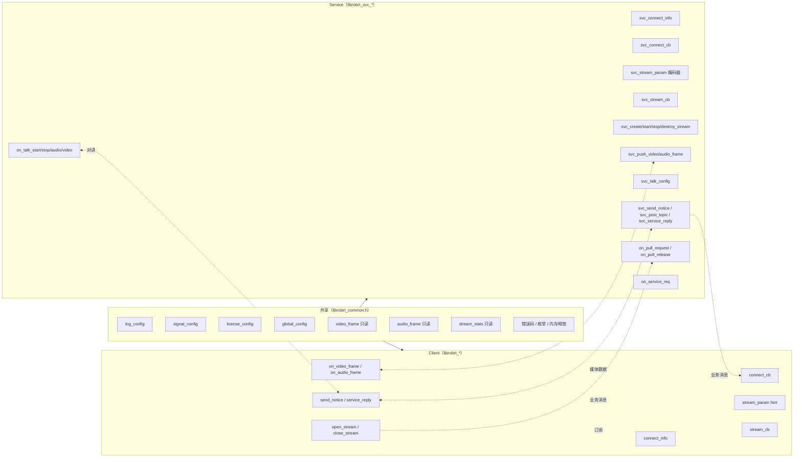

关键点：
- Client 的 `open_stream(index)` 在 Service 侧触发 `on_pull_request(stream_idx)`，业务层可据此惰性启动采集/编码。
- Client 的 `close_stream` / 主动 `disconnect` → Service 侧触发 `on_pull_release(stream_idx)`。
- Client 的 `send_notice` / `service_reply` → Service 侧 `on_notice` / 业务对 `on_service_req` 的回复反向亦然。
- 对讲方向：Client 采集 → 通过 Client 端内部通道 → Service 侧 `on_talk_audio` / `on_talk_video` 回调给业务播放。

---

## 3. 对象生命周期（状态机）

### 3.1 SDK 全局

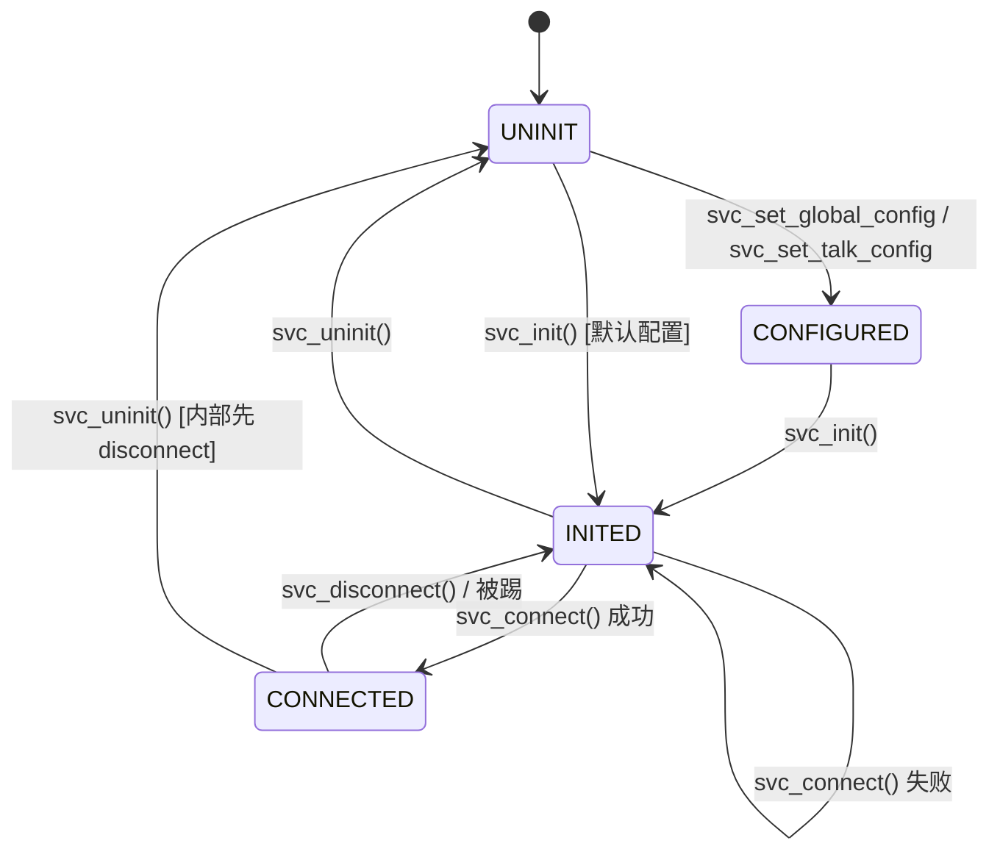

### 3.2 单路流

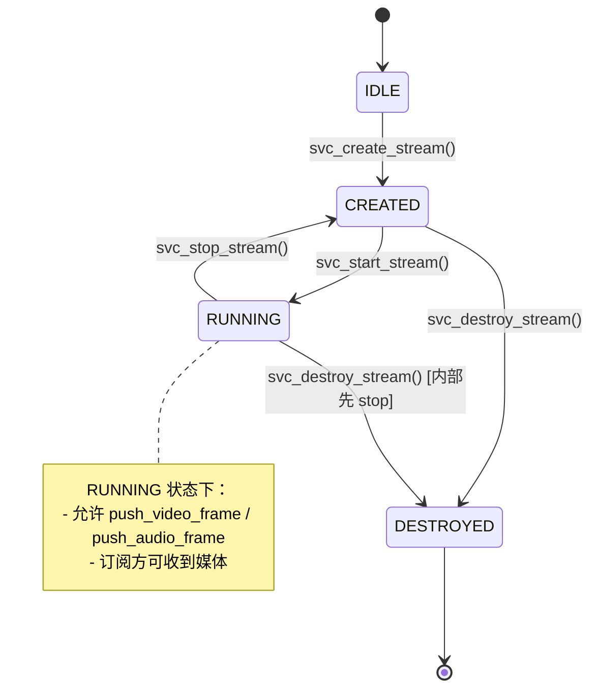

### 3.3 绑定状态

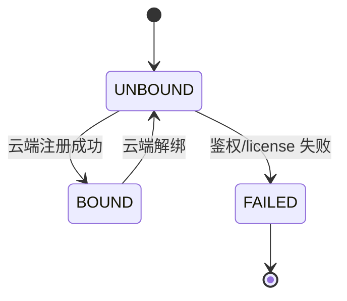

---

## 4. 标准调用时序

### 4.1 完整流程（启动 → 懒启动流 → 被 Client 订阅 → 停止）

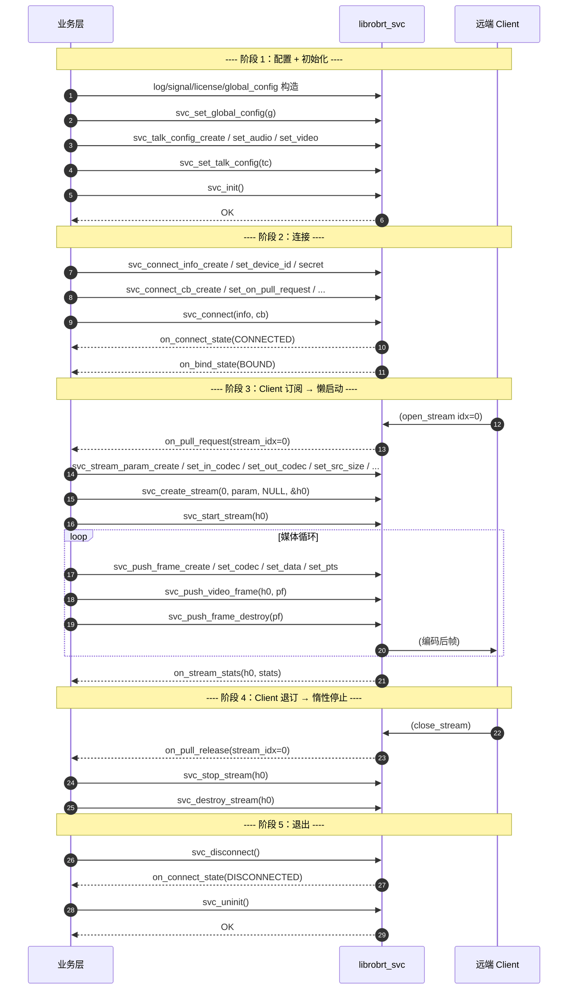

### 4.2 业务异常路径：直接 uninit（幂等强清理）

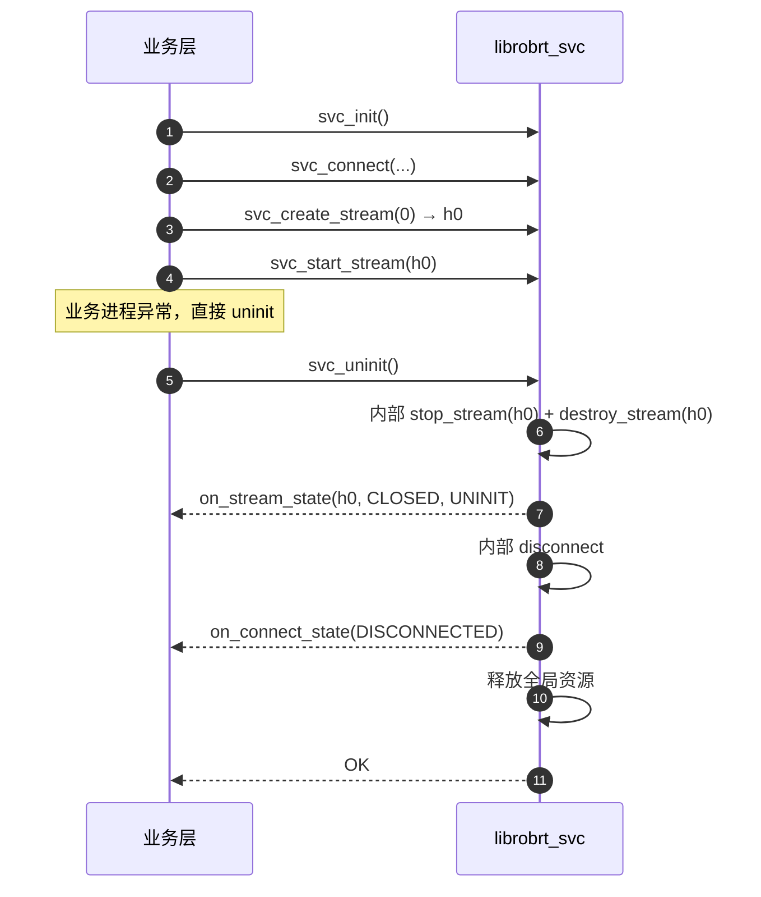

### 4.3 对讲反向流：Client 发起对讲，Service 接收音频

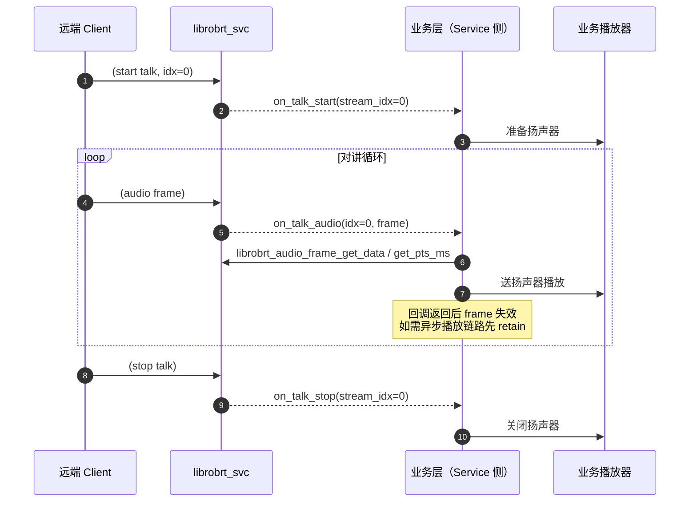

### 4.4 Client 服务请求 → Service 异步回包

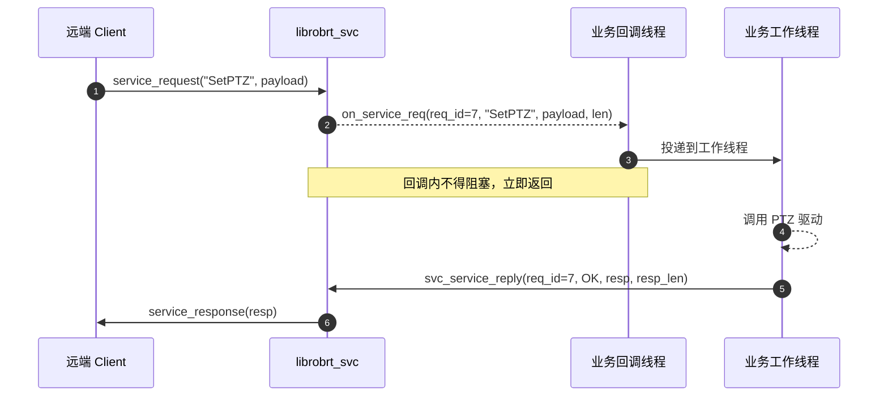

### 4.5 订阅端切换 / 引用计数式懒启动

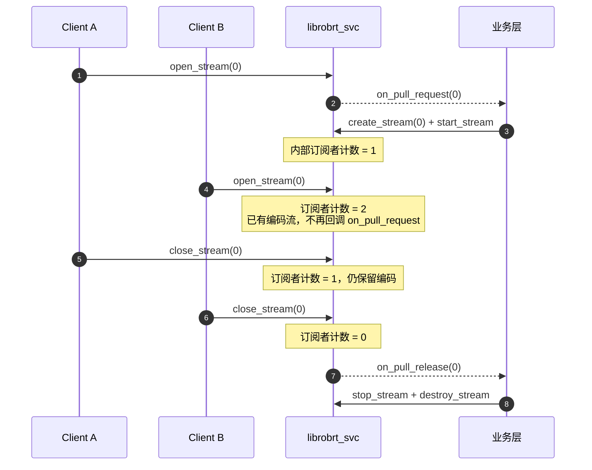

### 4.6 分片推送大帧（push_frame_set_flush / offset）

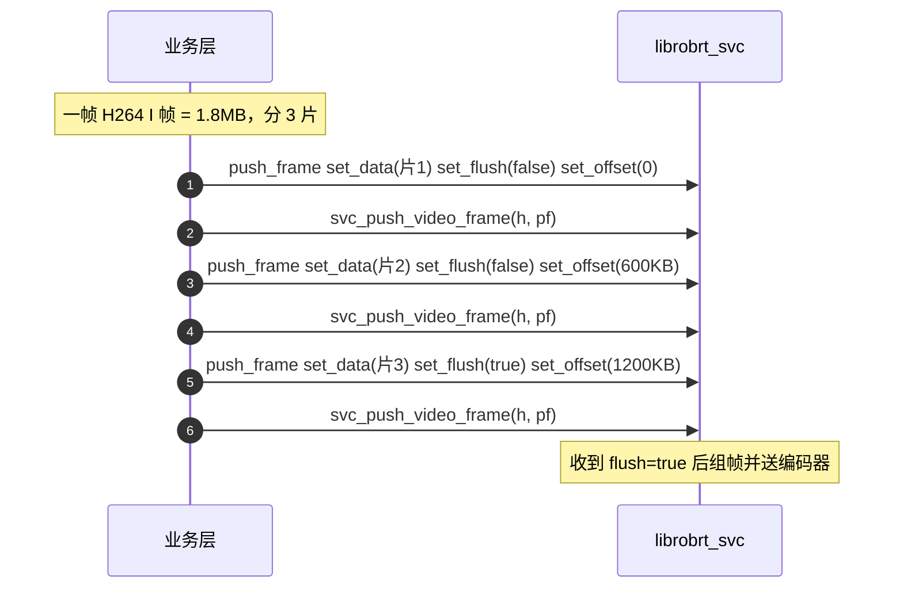

---

## 5. 线程与并发模型

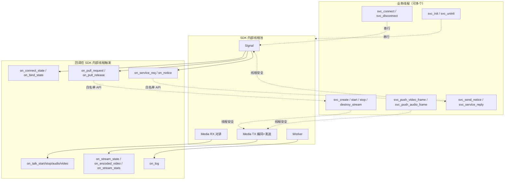

约束同 Client（见 `client_api_design.md` §5）：全局 API 串行、push/流控制 API 线程安全、回调内禁阻塞。

---

## 6. 内存所有权矩阵

| 对象 | 分配方 | 释放方 | 生命周期 |
|---|---|---|---|
| `librobrt_*_config_t`（共享 log/signal/license/global） | SDK `create` | 调用方 `destroy` | `svc_set_global_config` 返回后可销毁 |
| `librobrt_svc_connect_info_t` / `connect_cb_t` / `stream_param_t` / `stream_cb_t` / `talk_config_t` / `push_frame_t` | SDK `svc_*_create` | 调用方 `svc_*_destroy` | 对应 API 返回后可销毁 |
| `librobrt_svc_stream_handle_t` | SDK `create_stream` | SDK `destroy_stream` / `uninit` | 收到 `CLOSED/DESTROYED` 后失效 |
| `librobrt_video_frame_t` / `librobrt_audio_frame_t`（回调入参） | SDK | SDK（回调返回时） | 仅回调栈内；`retain` 后转为调用方管理 |
| `librobrt_stream_stats_t`（回调/pull 入参） | SDK | SDK | 仅调用栈内 |
| `librobrt_svc_license_info_t` | SDK（`get_license_info` 出参） | 调用方 `svc_license_info_destroy` | 显式生命周期 |
| push_frame 里 set_data 的 buffer | 调用方 | 调用方 | SDK 内部 copy，API 返回后可释放 |

---

## 7. 错误处理

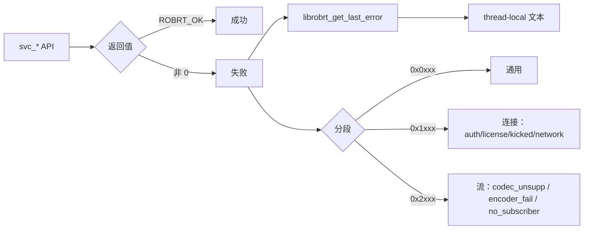

Service 专属错误码扩展（位于 0x2xxx 段）：
- `ROBRT_ERR_STREAM_ENCODER_FAIL` — 编码器初始化/编码失败
- `ROBRT_ERR_STREAM_NO_SUBSCRIBER` — 无订阅者时尝试某些只读状态操作

---

## 8. ABI 兼容性保证

与 Client 同策略（见 `client_api_design.md` §8）。

**补充**：
- `push_frame` 将来如需新增字段（如 HDR / 时间戳基准）→ 追加 `svc_push_frame_set_xxx`；旧调用方不受影响。
- `stream_param` 加新编码参数 → 追加 `svc_stream_param_set_xxx`。
- 新增回调事件 → 追加 `svc_connect_cb_set_on_xxx`。

---

## 9. 快速上手示例（C）

```c
#include "robrt/Service/librobrt_service_api.h"
#include <stdio.h>
#include <string.h>

static librobrt_svc_stream_handle_t g_h0 = NULL;

static void on_pull_req(int32_t idx, void *ud) {
    if (idx != 0 || g_h0) return;

    librobrt_svc_stream_param_t p = librobrt_svc_stream_param_create();
    librobrt_svc_stream_param_set_in_codec (p, ROBRT_CODEC_NV12);
    librobrt_svc_stream_param_set_out_codec(p, ROBRT_CODEC_H264);
    librobrt_svc_stream_param_set_src_size (p, 1920, 1080);
    librobrt_svc_stream_param_set_out_size (p, 1920, 1080);
    librobrt_svc_stream_param_set_fps      (p, 30);
    librobrt_svc_stream_param_set_gop      (p, 60);
    librobrt_svc_stream_param_set_rc_mode  (p, ROBRT_RC_CBR);
    librobrt_svc_stream_param_set_bitrate  (p, 4000, 6000);

    librobrt_svc_create_stream(idx, p, NULL, &g_h0);
    librobrt_svc_stream_param_destroy(p);
    librobrt_svc_start_stream(g_h0);
}

static void on_pull_rel(int32_t idx, void *ud) {
    if (idx != 0 || !g_h0) return;
    librobrt_svc_stop_stream(g_h0);
    librobrt_svc_destroy_stream(g_h0);
    g_h0 = NULL;
}

int main(void) {
    librobrt_global_config_t g = librobrt_global_config_create();
    librobrt_svc_set_global_config(g);
    librobrt_global_config_destroy(g);

    librobrt_svc_init();

    librobrt_svc_connect_info_t info = librobrt_svc_connect_info_create();
    librobrt_svc_connect_info_set_device_id    (info, "dev-001");
    librobrt_svc_connect_info_set_device_secret(info, "secret-xxx");

    librobrt_svc_connect_cb_t cb = librobrt_svc_connect_cb_create();
    librobrt_svc_connect_cb_set_on_pull_request(cb, on_pull_req);
    librobrt_svc_connect_cb_set_on_pull_release(cb, on_pull_rel);

    librobrt_svc_connect(info, cb);
    librobrt_svc_connect_info_destroy(info);
    librobrt_svc_connect_cb_destroy(cb);

    /* 假设上层每 33ms 推一帧 */
    /* while (running) {
           librobrt_svc_push_frame_t pf = librobrt_svc_push_frame_create();
           librobrt_svc_push_frame_set_codec  (pf, ROBRT_CODEC_NV12);
           librobrt_svc_push_frame_set_size   (pf, 1920, 1080);
           librobrt_svc_push_frame_set_data   (pf, yuv_buf, yuv_len);
           librobrt_svc_push_frame_set_pts_ms (pf, now_ms);
           librobrt_svc_push_video_frame(g_h0, pf);
           librobrt_svc_push_frame_destroy(pf);
       }
    */

    librobrt_svc_disconnect();
    librobrt_svc_uninit();
    return 0;
}
```

---

## 10. 设计关键决策说明

| 决策 | 理由 |
|---|---|
| **懒启动（on_pull_request 驱动）** | 避免业务一直采集/编码浪费 CPU；多订阅者共用一路编码流 |
| **push_frame 对象化** | 字段随编码格式演进会不断增加（HDR、颜色空间、时间基），用对象 + setter 避免长参数列表与签名破坏 |
| **svc_ 前缀** | 同一进程理论可同时加载 Client/Service（例如远程办公工具），避免符号碰撞 |
| **共享 video_frame / audio_frame / stream_stats** | 回调消费端逻辑一致，两端共享 getter 能减小集成认知成本 |
| **talk_config 独立 setter** | 对讲能力由业务决定（决定了能解什么码率/格式），与主媒体参数解耦 |
| **license_info 为 opaque + getter** | license 字段未来必然扩展（到期时间、配额、功能开关等），避免结构体暴露导致的大小变更 |
| **post_topic 作为透传通道** | 高频状态（心率/电量/PTZ 位置等）走透传不经业务层信令语义，减少业务实现压力 |

---

## 11. 落地对照

| 评审项（来自 `client_api_design_review.md` Service 映射） | 状态 |
|---|---|
| 不暴露结构体，opaque + get/set | ✅ |
| 编码参数仅在 Service | ✅ `svc_stream_param_*` |
| push_frame 对象化 | ✅ 对象 + 分片 flush/offset |
| 懒启动回调 | ✅ `on_pull_request` / `on_pull_release` |
| 对讲反向通道 | ✅ `on_talk_start/stop/audio/video` + `svc_talk_config` |
| 异步回包 | ✅ `svc_service_reply(req_id, ...)` |
| 幂等强清理 | ✅ `disconnect` / `uninit` / `destroy_stream` |
| 共享 common.h | ✅ 错误码 / 枚举 / 共享 config / 共享 frame getter |
| 运行期切 URL / license / 动态镜头数 | ❌ 按决策不做 |

